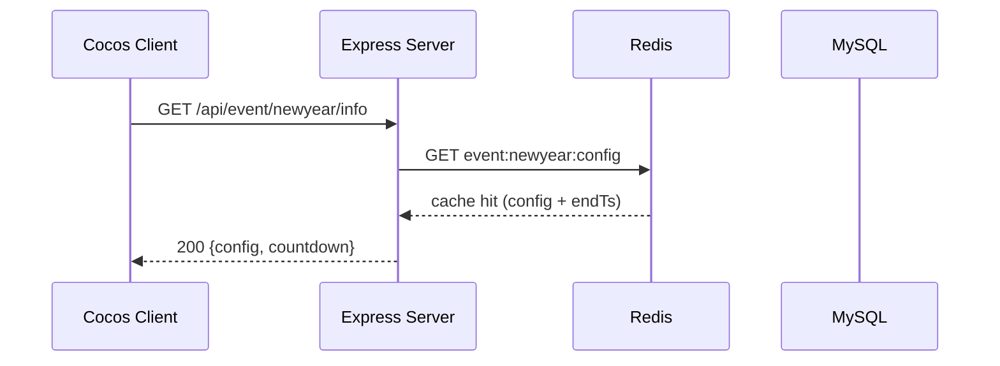
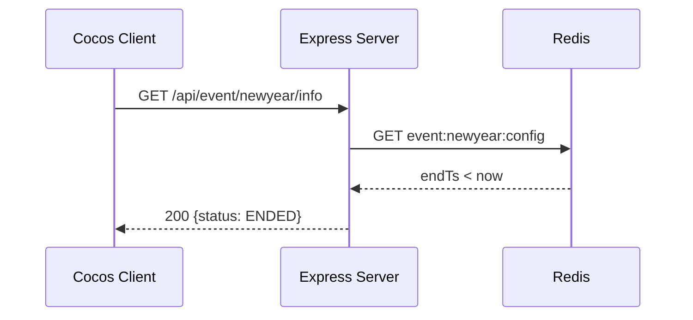
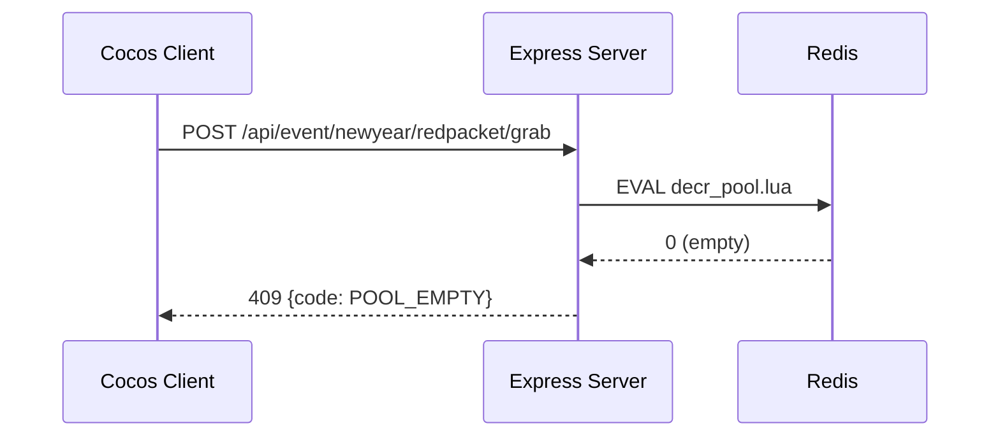
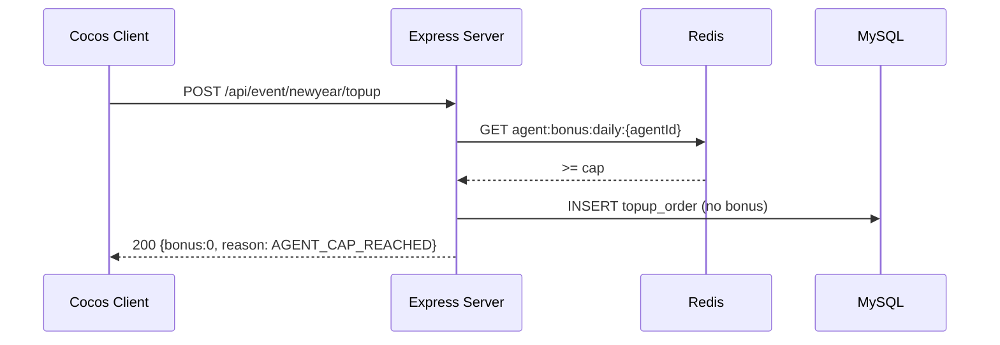

# 元旦跨年活動 BDD 測試案例

共 7 個 Scenario。

## 索引
| ID | 標題 | 類型 |
|----|------|------|
| [`sc-001`](#sc-001) | 活動期間進入活動頁顯示倒數計時 | 正常 |
| [`sc-002`](#sc-002) | 活動期間內首次儲值觸發限時加碼 | 正常 |
| [`sc-003`](#sc-003) | 跨年紅包雨整點開搶並掉落紅包 | 正常 |
| [`sc-004`](#sc-004) | 新年好運轉盤抽獎 | 正常 |
| [`sc-005`](#sc-005) | 活動結束後進入活動頁 | 邊界 |
| [`sc-006`](#sc-006) | 紅包雨獎池耗盡的同時點擊紅包 | 邊界 |
| [`sc-007`](#sc-007) | 代理商風控上限觸發限制儲值加碼 | 邊界 |

---

### <a id="sc-001"></a> Scenario: 活動期間進入活動頁顯示倒數計時
**類型**：正常（正常 / 邊界 / 異常）

**Gherkin（中）**
```gherkin
# language: zh-TW
Given 玩家已登入且當前時間為 2025-12-31 20:00（活動期間內）
When 玩家點擊跨年活動入口
Then 系統回傳活動資訊與倒數秒數，前端顯示倒數計時與煙火特效
```

**Gherkin（英）**
```gherkin
Given player is logged in during event window
When player opens the new year event page
Then server returns event info and countdown, client renders countdown and fireworks
```

**互動時序圖**


**涉及 API**
- [`api-001`](./new-year-event-spec-advanced.md#api-001)

**後端資料來源**
- Redis:event:newyear:config
- MySQL.event_config

---

### <a id="sc-002"></a> Scenario: 活動期間內首次儲值觸發限時加碼
**類型**：正常（正常 / 邊界 / 異常）

**Gherkin（中）**
```gherkin
# language: zh-TW
Given 玩家於 2025-12-31 22:00 進行儲值且尚未領取加碼
When 玩家完成 1000 元儲值
Then 系統發放加碼獎勵並寫入交易與獎勵紀錄
```

**Gherkin（英）**
```gherkin
Given player tops up during event and has not claimed bonus
When top-up of 1000 succeeds
Then system grants bonus and records transaction
```

**互動時序圖**
```mermaid
sequenceDiagram
  participant C as Cocos Client
  participant S as Express Server
  participant D as MySQL
  participant R as Redis
  C->>S: POST /api/event/newyear/topup
  S->>D: BEGIN; INSERT topup_order
  S->>D: SELECT bonus_claimed FROM event_bonus
  S->>D: INSERT event_bonus_log; UPDATE wallet
  S->>D: COMMIT
  S->>R: INCR event:newyear:bonus:count
  S-->>C: 200 {bonus, walletBalance}
```

**涉及 API**
- [`api-002`](./new-year-event-spec-advanced.md#api-002)

**後端資料來源**
- MySQL.topup_order
- MySQL.event_bonus_log
- MySQL.wallet
- Redis:event:newyear:bonus:count

---

### <a id="sc-003"></a> Scenario: 跨年紅包雨整點開搶並掉落紅包
**類型**：正常（正常 / 邊界 / 異常）

**Gherkin（中）**
```gherkin
# language: zh-TW
Given 玩家停留在活動頁且現在為紅包雨整點
When 紅包雨開始，玩家點擊掉落的紅包
Then 系統依紅包池發放金額並回傳結果
```

**Gherkin（英）**
```gherkin
Given player on event page at red packet rain time
When player taps a falling red packet
Then server grants amount from pool and returns result
```

**互動時序圖**
```mermaid
sequenceDiagram
  participant C as Cocos Client
  participant S as Express Server
  participant R as Redis
  participant D as MySQL
  C->>S: POST /api/event/newyear/redpacket/grab
  S->>R: EVAL decr_pool.lua (atomic pool decrement)
  R-->>S: amount
  S->>D: INSERT red_packet_log; UPDATE wallet
  S-->>C: 200 {amount}
```

**涉及 API**
- [`api-003`](./new-year-event-spec-advanced.md#api-003)

**後端資料來源**
- Redis:event:newyear:redpool
- MySQL.red_packet_log
- MySQL.wallet

---

### <a id="sc-004"></a> Scenario: 新年好運轉盤抽獎
**類型**：正常（正常 / 邊界 / 異常）

**Gherkin（中）**
```gherkin
# language: zh-TW
Given 玩家擁有 1 次轉盤次數
When 玩家點擊「轉一次」
Then 系統依權重抽出獎項，扣除次數並發放獎勵
```

**Gherkin（英）**
```gherkin
Given player has 1 spin chance
When player spins the wheel
Then system draws prize by weight, deducts chance and grants reward
```

**互動時序圖**
```mermaid
sequenceDiagram
  participant C as Cocos Client
  participant S as Express Server
  participant R as Redis
  participant D as MySQL
  C->>S: POST /api/event/newyear/wheel/spin
  S->>R: DECR event:newyear:wheel:chance:{uid}
  R-->>S: remaining>=0
  S->>D: SELECT wheel_prize_config
  S->>D: INSERT wheel_spin_log; UPDATE wallet
  S-->>C: 200 {prize, remaining}
```

**涉及 API**
- [`api-004`](./new-year-event-spec-advanced.md#api-004)

**後端資料來源**
- Redis:event:newyear:wheel:chance:{uid}
- MySQL.wheel_prize_config
- MySQL.wheel_spin_log
- MySQL.wallet

---

### <a id="sc-005"></a> Scenario: 活動結束後進入活動頁
**類型**：邊界（正常 / 邊界 / 異常）

**Gherkin（中）**
```gherkin
# language: zh-TW
Given 當前時間為 2026-01-03 00:00（活動已結束）
When 玩家點擊跨年活動入口
Then 系統回傳活動已結束狀態，前端顯示結算頁不再提供互動
```

**Gherkin（英）**
```gherkin
Given current time is after event end
When player opens the event page
Then server returns ENDED status and client shows settlement view
```

**互動時序圖**


**涉及 API**
- [`api-001`](./new-year-event-spec-advanced.md#api-001)

**後端資料來源**
- Redis:event:newyear:config

---

### <a id="sc-006"></a> Scenario: 紅包雨獎池耗盡的同時點擊紅包
**類型**：邊界（正常 / 邊界 / 異常）

**Gherkin（中）**
```gherkin
# language: zh-TW
Given 紅包雨剩餘獎池為 0
When 玩家點擊掉落的紅包
Then 系統回傳獎池已空，不扣紅包不發獎
```

**Gherkin（英）**
```gherkin
Given red packet pool is empty
When player taps a red packet
Then server returns POOL_EMPTY with no payout
```

**互動時序圖**


**涉及 API**
- [`api-003`](./new-year-event-spec-advanced.md#api-003)

**後端資料來源**
- Redis:event:newyear:redpool

---

### <a id="sc-007"></a> Scenario: 代理商風控上限觸發限制儲值加碼
**類型**：邊界（正常 / 邊界 / 異常）

**Gherkin（中）**
```gherkin
# language: zh-TW
Given 代理商當日加碼總額已達設定上限
When 旗下玩家嘗試領取限時儲值加碼
Then 系統拒絕加碼以保護代理商損益，僅記錄原始儲值
```

**Gherkin（英）**
```gherkin
Given agent daily bonus cap reached
When player attempts to claim top-up bonus
Then system rejects bonus to protect agent P&L; only records top-up
```

**互動時序圖**


**涉及 API**
- [`api-002`](./new-year-event-spec-advanced.md#api-002)

**後端資料來源**
- Redis:agent:bonus:daily:{agentId}
- MySQL.topup_order
- MySQL.agent_risk_config

---

