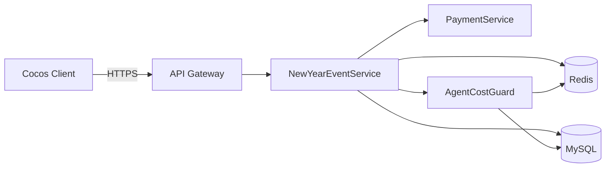

# 元旦跨年活動 技術規格書

## 一、系統架構概覽
元旦跨年活動由 Express 提供 NewYearEventService，整合活動配置、倒數計時、限時加碼儲值、紅包雨、好運轉盤五大子系統。資料持久層使用 MySQL（活動設定 event_config、玩家進度 player_event_progress、紅包雨領取 redpacket_claims、轉盤紀錄 wheel_spins、加碼儲值訂單 topup_bonus_orders），Redis 用於高頻讀取（活動狀態、伺服器時間、紅包雨剩餘量、玩家每日次數）與分散式鎖（防止重複領取/重複加碼）。代理商損失控管透過 agent_cost_ledger 表 + Redis 即時池上限，確保每位代理商當日支出不超過預算。



**Client ↔ Server 資料流**：Client 進入活動頁時呼叫 GET /event/status 取得活動時段、伺服器時間與玩家進度（Redis 快取）；倒數時間由 server_time 對齊。儲值加碼透過 PaymentService 回呼觸發 NewYearEventService 寫入 topup_bonus_orders 並扣 agent_cost_ledger 額度。紅包雨採 Redis 原子扣減 + MySQL 非同步落地。好運轉盤透過 Lua script 保證權重抽獎與每日次數原子性。所有派獎前先經 AgentCostGuard 檢查代理商預算池，不足則降級為小獎或拒絕。

## 二、Cocos Creator Client 實作要點
- **建議場景結構**：NewYearEventScene 包含 Canvas/CountdownLayer（倒數）/FireworksLayer（粒子煙火）/TopupBonusPanel（限時加碼）/RedPacketRainLayer（紅包雨）/LuckyWheelPanel（轉盤）/RewardPopup（中獎彈窗）
- **主要 Components**：
  - `EventCountdownComponent` — 訂閱 server_time 校正本地倒數，倒數結束切換活動階段（pre/active/end）
  - `FireworksParticleComponent` — 使用 Cocos ParticleSystem2D 播放跨年煙火，零點觸發全屏特效
  - `TopupBonusComponent` — 顯示限時加碼檔位、剩餘時間、已購買次數，呼叫 /topup/bonus/list 與 /topup/bonus/purchase
  - `RedPacketRainComponent` — 管理紅包掉落物件池（50 顆），點擊觸發 /redpacket/claim，採節流 100ms
  - `LuckyWheelComponent` — 轉盤動畫，呼叫 /wheel/spin，依 server 回傳 index 對齊停止位置
  - `EventApiClient` — 統一 HTTP 封裝、Token 注入、錯誤降級、本地快取活動配置
- **動畫狀態機**：

| 狀態 | 觸發 | 下一狀態 |
|------|------|---------|
| Idle | 進入活動場景 | Loading |
| Loading | GET /event/status 成功 | PreEvent |
| PreEvent | server_time 達到 start_at | Active |
| Active | 點擊紅包雨入口 | RedPacketRaining |
| RedPacketRaining | 30秒倒數結束 或 領完 | Active |
| Active | 點擊轉盤 | Spinning |
| Spinning | server 回傳結果 | ShowReward |
| ShowReward | 關閉彈窗 | Active |
| Active | server_time 達到 end_at | EventEnd |

- **資料更新**：活動狀態與倒數採 HTTP 短輪詢（15s）+ 進場拉一次；紅包雨/轉盤採事件驅動 HTTP 同步呼叫；伺服器時間每 60s 校正一次避免時差。
- **效能考量**：活動配置與圖檔走 CDN + 本地快取；粒子特效控制在同屏 ≤ 200 粒子；紅包物件池重用避免 GC；API 失敗採指數退避，避免 0:00 瞬間流量峰值打爆服務。

## 三、Node.js Server API 規格

### API 端點列表
| ID | Method | Endpoint | 說明 | 認證 | 讀 | 寫 |
|----|--------|----------|------|------|----|----|
| [`api-001`](#api-001) | GET | /api/v1/event/newyear/status | 取得活動狀態、伺服器時間與玩家進度 | Bearer Token | MySQL.event_config / MySQL.player_event_progress / Redis:event:newyear:config | Redis:event:newyear:progress:{user_id} |
| [`api-002`](#api-002) | GET | /api/v1/event/newyear/topup/bonus/list | 取得限時儲值加碼檔位列表 | Bearer Token | MySQL.topup_bonus_config / Redis:event:newyear:topup:purchased:{user_id} | - |
| [`api-003`](#api-003) | POST | /api/v1/event/newyear/topup/bonus/purchase | 建立限時加碼儲值訂單（含代理商預算守衛） | Bearer Token | MySQL.topup_bonus_config / MySQL.agent_cost_ledger / Redis:agent:budget:{agent_id}:{date} | MySQL.topup_bonus_orders / MySQL.agent_cost_ledger / Redis:event:newyear:topup:purchased:{user_id} |
| [`api-004`](#api-004) | POST | /api/v1/event/newyear/redpacket/enter | 進入紅包雨場次（30 秒一場） | Bearer Token | MySQL.redpacket_session_config / Redis:event:newyear:redpacket:session:{session_id} | Redis:event:newyear:redpacket:user:{user_id}:{session_id} |
| [`api-005`](#api-005) | POST | /api/v1/event/newyear/redpacket/claim | 領取單顆紅包（原子扣池） | Bearer Token | Redis:event:newyear:redpacket:pool:{session_id} / Redis:agent:budget:{agent_id}:{date} | Redis:event:newyear:redpacket:claimed:{user_id}:{session_id} / MySQL.redpacket_claims (async) |
| [`api-006`](#api-006) | GET | /api/v1/event/newyear/wheel/info | 取得轉盤獎項與剩餘次數 | Bearer Token | MySQL.wheel_prize_config / Redis:event:newyear:wheel:user:{user_id} | - |
| [`api-007`](#api-007) | POST | /api/v1/event/newyear/wheel/spin | 執行轉盤抽獎 | Bearer Token | MySQL.wheel_prize_config / Redis:event:newyear:wheel:user:{user_id} / Redis:agent:budget:{agent_id}:{date} | MySQL.wheel_spins / MySQL.player_event_progress / Redis:event:newyear:wheel:user:{user_id} |
| [`api-008`](#api-008) | GET | /api/v1/event/newyear/rewards/history | 查詢玩家活動獎勵歷史 | Bearer Token | MySQL.wheel_spins / MySQL.redpacket_claims / MySQL.topup_bonus_orders | - |

### 各 API 詳細規格

#### <a id="api-001"></a> [api-001] GET /api/v1/event/newyear/status
- **說明**：取得活動狀態、伺服器時間與玩家進度
- **認證**：Bearer Token
- **Query Params**：
  - `event_id` string default=newyear_2026 — 活動 ID
- **Response 200**：
```json
{
  "code": 200,
  "data": {
    "event_id": "newyear_2026",
    "server_time": 1735660800,
    "start_at": 1735660800,
    "end_at": 1735920000,
    "phase": "active",
    "progress": {"wheel_free_left": 3, "redpacket_joined": false, "topup_bonus_purchased": 1}
  }
}
```
- **Errors**：
  - `401` 未登入
  - `4041` 活動不存在
- **後端流程**：
  1. 驗證 Token 與 user_id
  2. Redis 讀取活動配置（miss 回源 MySQL.event_config）
  3. 查詢 MySQL.player_event_progress 取得玩家進度
  4. 計算當前 phase（pre/active/end）
  5. 回傳活動狀態 + server_time
- **效能要求**：p95 < 50ms / QPS 5000
- **相關 BDD**：[`sc-001`](./new-year-event-bdd.md#sc-001), [`sc-002`](./new-year-event-bdd.md#sc-002)
#### <a id="api-002"></a> [api-002] GET /api/v1/event/newyear/topup/bonus/list
- **說明**：取得限時儲值加碼檔位列表
- **認證**：Bearer Token
- **Response 200**：
```json
{
  "code": 200,
  "data": {
    "items": [
      {"sku_id": "ny_topup_60", "price": 60, "base_coins": 600, "bonus_coins": 300, "bonus_rate": 0.5, "daily_limit": 3, "purchased": 1}
    ]
  }
}
```
- **Errors**：
  - `401` 未登入
- **後端流程**：
  1. 驗證 Token
  2. 查詢 topup_bonus_config
  3. 查詢玩家今日購買次數
  4. 計算剩餘可購買數
  5. 回傳列表
- **效能要求**：p95 < 80ms / QPS 2000
- **相關 BDD**：[`sc-003`](./new-year-event-bdd.md#sc-003)
#### <a id="api-003"></a> [api-003] POST /api/v1/event/newyear/topup/bonus/purchase
- **說明**：建立限時加碼儲值訂單（含代理商預算守衛）
- **認證**：Bearer Token
- **Response 200**：
```json
{
  "code": 200,
  "data": {
    "order_id": "NYO20260101001",
    "pay_url": "https://pay.example.com/xxx",
    "expire_at": 1735664400
  }
}
```
- **Errors**：
  - `401` 未登入
  - `4001` 活動非進行中
  - `4002` 已達每日購買上限
  - `4003` 代理商預算池不足，降級或拒絕
- **後端流程**：
  1. 驗證 Token 取得 user_id 與 agent_id
  2. Redis 鎖 lock:topup:{user_id}:{sku_id} TTL 5s
  3. 檢查活動 phase 與每日限購
  4. AgentCostGuard 預扣 agent_cost_ledger（bonus_coins 折算成本）
  5. 建立 topup_bonus_orders（status=pending）
  6. 呼叫 PaymentService 取得 pay_url
  7. 釋放鎖並回傳
- **效能要求**：p95 < 150ms / QPS 500
- **相關 BDD**：[`sc-003`](./new-year-event-bdd.md#sc-003), [`sc-007`](./new-year-event-bdd.md#sc-007)
#### <a id="api-004"></a> [api-004] POST /api/v1/event/newyear/redpacket/enter
- **說明**：進入紅包雨場次（30 秒一場）
- **認證**：Bearer Token
- **Response 200**：
```json
{
  "code": 200,
  "data": {
    "session_id": "rp_20260101_0000",
    "duration_sec": 30,
    "max_claims": 10,
    "server_time": 1735660800
  }
}
```
- **Errors**：
  - `401` 未登入
  - `4004` 非紅包雨開放時間
  - `4005` 今日已參加
- **後端流程**：
  1. 驗證 Token
  2. 檢查當前是否在紅包雨開放時段（每整點 1 場）
  3. 檢查玩家今日是否已參加（Redis SET）
  4. 標記參加狀態 TTL 至活動結束
  5. 回傳場次資訊
- **效能要求**：p95 < 60ms / QPS 3000
- **相關 BDD**：[`sc-004`](./new-year-event-bdd.md#sc-004)
#### <a id="api-005"></a> [api-005] POST /api/v1/event/newyear/redpacket/claim
- **說明**：領取單顆紅包（原子扣池）
- **認證**：Bearer Token
- **Response 200**：
```json
{
  "code": 200,
  "data": {
    "claim_id": "rpc_xxx",
    "coins": 50,
    "claimed_count": 3,
    "max_claims": 10
  }
}
```
- **Errors**：
  - `401` 未登入
  - `4006` 已達單場領取上限
  - `4007` 紅包池已空（降級為 0 幣安慰）
  - `4029` 請求過於頻繁
- **後端流程**：
  1. 驗證 Token + 節流（Redis incr 100ms 內 ≤1）
  2. Lua script 原子：檢查 claimed_count < max_claims, 扣 redpacket_pool, 隨機取金額
  3. AgentCostGuard 扣 agent_budget（超預算則回 0 幣）
  4. 寫入 Redis claimed 紀錄
  5. 非同步 MQ 落地 MySQL.redpacket_claims
  6. 回傳金額
- **效能要求**：p95 < 30ms / QPS 20000
- **相關 BDD**：[`sc-004`](./new-year-event-bdd.md#sc-004), [`sc-007`](./new-year-event-bdd.md#sc-007)
#### <a id="api-006"></a> [api-006] GET /api/v1/event/newyear/wheel/info
- **說明**：取得轉盤獎項與剩餘次數
- **認證**：Bearer Token
- **Response 200**：
```json
{
  "code": 200,
  "data": {
    "prizes": [
      {"index": 0, "name": "金幣1000", "icon": "coin_1000"},
      {"index": 1, "name": "謝謝參與", "icon": "thanks"}
    ],
    "free_left": 3,
    "paid_cost": 50,
    "daily_paid_left": 10
  }
}
```
- **Errors**：
  - `401` 未登入
- **後端流程**：
  1. 驗證 Token
  2. 讀取轉盤獎項配置（脫敏，不回傳機率）
  3. 讀取玩家今日免費/付費次數
  4. 回傳
- **效能要求**：p95 < 60ms / QPS 2000
- **相關 BDD**：[`sc-005`](./new-year-event-bdd.md#sc-005)
#### <a id="api-007"></a> [api-007] POST /api/v1/event/newyear/wheel/spin
- **說明**：執行轉盤抽獎
- **認證**：Bearer Token
- **Response 200**：
```json
{
  "code": 200,
  "data": {
    "spin_id": "ws_xxx",
    "prize_index": 2,
    "prize_name": "金幣500",
    "coins": 500,
    "free_left": 2
  }
}
```
- **Errors**：
  - `401` 未登入
  - `4008` 次數已用完
  - `4009` 金幣不足（付費抽）
  - `4003` 代理商預算池不足，自動降級為小獎
- **後端流程**：
  1. 驗證 Token
  2. Lua script：原子扣次數（優先免費再付費）
  3. 加權隨機選獎（依 wheel_prize_config.weight）
  4. AgentCostGuard：若代理商預算將爆，將大獎降級為小獎或謝謝參與
  5. 寫入 wheel_spins
  6. 發放獎勵（金幣/道具）
  7. 回傳結果
- **效能要求**：p95 < 100ms / QPS 1000
- **相關 BDD**：[`sc-005`](./new-year-event-bdd.md#sc-005), [`sc-007`](./new-year-event-bdd.md#sc-007)
#### <a id="api-008"></a> [api-008] GET /api/v1/event/newyear/rewards/history
- **說明**：查詢玩家活動獎勵歷史
- **認證**：Bearer Token
- **Query Params**：
  - `page` int default=1 — 頁碼
  - `size` int default=20 — 每頁筆數
- **Response 200**：
```json
{
  "code": 200,
  "data": {
    "items": [{"type": "wheel", "reward": "金幣500", "created_at": 1735660800}],
    "total": 25
  }
}
```
- **Errors**：
  - `401` 未登入
- **後端流程**：
  1. 驗證 Token
  2. UNION ALL 三表查詢（依 user_id 與活動區間）
  3. 分頁回傳
- **效能要求**：p95 < 120ms / QPS 500
- **相關 BDD**：[`sc-006`](./new-year-event-bdd.md#sc-006)

## 四、資料模型

### event_config（MySQL Table）
活動主檔（含時段、開關、版本）

| 欄位 | 型別 | 說明 |
|------|------|------|
| `id` | BIGINT UNSIGNED PK AUTO_INCREMENT | PK |
| `event_id` | VARCHAR(64) | 活動 ID，如 newyear_2026 |
| `name` | VARCHAR(128) | 活動名稱 |
| `start_at` | DATETIME | 開始時間 |
| `end_at` | DATETIME | 結束時間 |
| `status` | TINYINT | 0=停用 1=啟用 |
| `config` | JSON | 額外配置（紅包雨時段、煙火開關） |
| `created_at` | DATETIME | 建立時間 |
| `updated_at` | DATETIME | 更新時間 |

**索引**：UNIQUE KEY uk_event_id (event_id), INDEX idx_status_time (status, start_at, end_at)
**讀寫 API**：`api-001`
### player_event_progress（MySQL Table）
玩家活動進度

| 欄位 | 型別 | 說明 |
|------|------|------|
| `id` | BIGINT UNSIGNED PK AUTO_INCREMENT | PK |
| `user_id` | BIGINT UNSIGNED | 玩家 ID |
| `event_id` | VARCHAR(64) | 活動 ID |
| `wheel_free_used` | INT UNSIGNED | 今日免費轉盤已用次數 |
| `wheel_paid_used` | INT UNSIGNED | 今日付費轉盤已用次數 |
| `redpacket_sessions` | JSON | 已參加的紅包雨場次 |
| `topup_bonus_purchased` | JSON | 加碼儲值購買紀錄 {sku_id: count} |
| `last_reset_date` | DATE | 上次每日重置日期 |
| `updated_at` | DATETIME | 更新時間 |

**索引**：UNIQUE KEY uk_user_event (user_id, event_id), INDEX idx_event (event_id)
**讀寫 API**：`api-001`, `api-007`
### topup_bonus_config（MySQL Table）
限時加碼儲值檔位設定

| 欄位 | 型別 | 說明 |
|------|------|------|
| `id` | BIGINT UNSIGNED PK AUTO_INCREMENT | PK |
| `event_id` | VARCHAR(64) | 活動 ID |
| `sku_id` | VARCHAR(64) | 商品 SKU |
| `price` | DECIMAL(10,2) | 售價 |
| `base_coins` | INT UNSIGNED | 基礎金幣 |
| `bonus_coins` | INT UNSIGNED | 加碼金幣 |
| `bonus_rate` | DECIMAL(4,2) | 加碼比例 |
| `daily_limit` | INT UNSIGNED | 每日購買上限 |
| `sort_order` | INT | 排序 |
| `status` | TINYINT | 啟用狀態 |

**索引**：UNIQUE KEY uk_event_sku (event_id, sku_id), INDEX idx_event_status (event_id, status)
**讀寫 API**：`api-002`, `api-003`
### topup_bonus_orders（MySQL Table）
加碼儲值訂單

| 欄位 | 型別 | 說明 |
|------|------|------|
| `id` | BIGINT UNSIGNED PK AUTO_INCREMENT | PK |
| `order_id` | VARCHAR(64) | 訂單號 |
| `user_id` | BIGINT UNSIGNED | 玩家 ID |
| `agent_id` | BIGINT UNSIGNED | 代理商 ID |
| `event_id` | VARCHAR(64) | 活動 ID |
| `sku_id` | VARCHAR(64) | SKU |
| `price` | DECIMAL(10,2) | 售價 |
| `base_coins` | INT UNSIGNED | 基礎金幣 |
| `bonus_coins` | INT UNSIGNED | 加碼金幣 |
| `status` | TINYINT | 0=待付 1=已付 2=發放完成 9=取消 |
| `paid_at` | DATETIME | 付款時間 |
| `created_at` | DATETIME | 建立時間 |

**索引**：UNIQUE KEY uk_order_id (order_id), INDEX idx_user_event (user_id, event_id), INDEX idx_agent_date (agent_id, created_at), INDEX idx_status (status)
**讀寫 API**：`api-003`, `api-008`
### redpacket_session_config（MySQL Table）
紅包雨場次設定

| 欄位 | 型別 | 說明 |
|------|------|------|
| `id` | BIGINT UNSIGNED PK AUTO_INCREMENT | PK |
| `event_id` | VARCHAR(64) | 活動 ID |
| `session_time` | DATETIME | 場次開始時間 |
| `duration_sec` | INT UNSIGNED | 持續秒數 |
| `total_pool` | INT UNSIGNED | 場次總金幣池 |
| `max_claims_per_user` | INT UNSIGNED | 每人最多領 |
| `min_coins` | INT UNSIGNED | 單顆下限 |
| `max_coins` | INT UNSIGNED | 單顆上限 |

**索引**：INDEX idx_event_time (event_id, session_time)
**讀寫 API**：`api-004`
### redpacket_claims（MySQL Table）
紅包領取紀錄（從 Redis 非同步落地）

| 欄位 | 型別 | 說明 |
|------|------|------|
| `id` | BIGINT UNSIGNED PK AUTO_INCREMENT | PK |
| `claim_id` | VARCHAR(64) | 領取編號 |
| `session_id` | VARCHAR(64) | 場次 ID |
| `user_id` | BIGINT UNSIGNED | 玩家 ID |
| `agent_id` | BIGINT UNSIGNED | 代理商 ID |
| `coins` | INT UNSIGNED | 獲得金幣 |
| `claimed_at` | DATETIME(3) | 領取時間（毫秒精度） |

**索引**：UNIQUE KEY uk_claim_id (claim_id), INDEX idx_session_user (session_id, user_id), INDEX idx_user_time (user_id, claimed_at)
**讀寫 API**：`api-005`, `api-008`
### wheel_prize_config（MySQL Table）
轉盤獎項與權重

| 欄位 | 型別 | 說明 |
|------|------|------|
| `id` | BIGINT UNSIGNED PK AUTO_INCREMENT | PK |
| `event_id` | VARCHAR(64) | 活動 ID |
| `prize_index` | TINYINT UNSIGNED | 轉盤位置 0-7 |
| `prize_type` | VARCHAR(32) | coin/item/thanks |
| `prize_value` | INT UNSIGNED | 數值（金幣數） |
| `weight` | INT UNSIGNED | 權重（千分位） |
| `cost` | INT UNSIGNED | 代理商成本（折算） |
| `is_big_prize` | TINYINT | 是否大獎（降級判斷） |

**索引**：UNIQUE KEY uk_event_index (event_id, prize_index)
**讀寫 API**：`api-006`, `api-007`
### wheel_spins（MySQL Table）
轉盤抽獎紀錄

| 欄位 | 型別 | 說明 |
|------|------|------|
| `id` | BIGINT UNSIGNED PK AUTO_INCREMENT | PK |
| `spin_id` | VARCHAR(64) | 抽獎編號 |
| `user_id` | BIGINT UNSIGNED | 玩家 ID |
| `agent_id` | BIGINT UNSIGNED | 代理商 ID |
| `event_id` | VARCHAR(64) | 活動 ID |
| `prize_index` | TINYINT UNSIGNED | 中獎位置 |
| `prize_value` | INT UNSIGNED | 獲得數值 |
| `is_free` | TINYINT | 1=免費 0=付費 |
| `is_degraded` | TINYINT | 是否被降級 |
| `created_at` | DATETIME(3) | 時間 |

**索引**：UNIQUE KEY uk_spin_id (spin_id), INDEX idx_user_time (user_id, created_at), INDEX idx_agent_date (agent_id, created_at)
**讀寫 API**：`api-007`, `api-008`
### agent_cost_ledger（MySQL Table）
代理商活動成本帳本（保護代理商不損失）

| 欄位 | 型別 | 說明 |
|------|------|------|
| `id` | BIGINT UNSIGNED PK AUTO_INCREMENT | PK |
| `agent_id` | BIGINT UNSIGNED | 代理商 ID |
| `event_id` | VARCHAR(64) | 活動 ID |
| `date` | DATE | 統計日期 |
| `daily_budget` | INT UNSIGNED | 當日預算上限 |
| `used_cost` | INT UNSIGNED | 已用成本 |
| `topup_revenue` | INT UNSIGNED | 當日儲值營收 |
| `updated_at` | DATETIME | 更新時間 |

**索引**：UNIQUE KEY uk_agent_event_date (agent_id, event_id, date), INDEX idx_date (date)
**讀寫 API**：`api-003`, `api-005`, `api-007`

## 五、業務邏輯

### 活動階段判定
依 server_time 與 event_config.start_at/end_at 決定 pre/active/end

```
function getPhase(now, cfg) {
  if (now < cfg.start_at) return 'pre';
  if (now >= cfg.end_at) return 'end';
  return 'active';
}
```
### 紅包雨原子領取（Lua）
Redis Lua script 確保扣池、扣次數、隨機金額為單一原子操作

```
-- KEYS: pool_key, user_claim_key
-- ARGV: max_claims, min_coin, max_coin, ttl
local claimed = tonumber(redis.call('GET', KEYS[2]) or 0)
if claimed >= tonumber(ARGV[1]) then return -1 end
local pool = tonumber(redis.call('GET', KEYS[1]) or 0)
if pool <= 0 then return 0 end
local coin = math.random(tonumber(ARGV[2]), tonumber(ARGV[3]))
if coin > pool then coin = pool end
redis.call('DECRBY', KEYS[1], coin)
redis.call('INCR', KEYS[2])
redis.call('EXPIRE', KEYS[2], tonumber(ARGV[4]))
return coin
```
### 轉盤加權抽獎 + 代理商保護降級
先依權重抽獎，若中大獎但代理商當日預算 < 成本，則降級為小獎或謝謝參與

```
function spinWheel(userId, agentId, eventId) {
  const prizes = loadPrizes(eventId);
  const totalW = sum(prizes.map(p => p.weight));
  let r = secureRandom(totalW);
  let hit = prizes.find(p => (r -= p.weight) < 0);
  const budget = getAgentBudget(agentId, today);
  if (hit.is_big_prize && budget.used + hit.cost > budget.daily) {
    hit = prizes.find(p => !p.is_big_prize && p.prize_type !== 'thanks')
          || prizes.find(p => p.prize_type === 'thanks');
    markDegraded();
  }
  deductBudget(agentId, hit.cost);
  return hit;
}
```
### 代理商預算守衛（AgentCostGuard）
所有派獎前先檢查 Redis 即時池，超過則拒絕或降級，每分鐘 sync 回 MySQL.agent_cost_ledger

```
function reserve(agentId, cost) {
  const key = `agent:budget:${agentId}:${today}`;
  const used = redis.incrBy(key, cost);
  redis.expire(key, 172800);
  const limit = getDailyBudget(agentId);
  if (used > limit) {
    redis.decrBy(key, cost);
    return false;
  }
  return true;
}
```
### 限時加碼每日限購
以 Redis 計數器 + MySQL 訂單為雙重保險，避免重複扣與超購

```
function purchaseBonus(userId, skuId) {
  const lockKey = `lock:topup:${userId}:${skuId}`;
  if (!redis.setNx(lockKey, 1, 'EX', 5)) throw '4029';
  try {
    const used = redis.get(`topup:${userId}:${skuId}:${today}`) || 0;
    if (used >= sku.daily_limit) throw '4002';
    if (!agentGuard.reserve(agentId, sku.cost)) throw '4003';
    const order = createOrder(...);
    redis.incr(counterKey); redis.expire(counterKey, 86400);
    return order;
  } finally { redis.del(lockKey); }
}
```
### 每日重置
每日 00:00 由 cron 重置玩家轉盤次數、紅包參加狀態與代理商預算池

```
cron('0 0 * * *', () => {
  resetPlayerDailyCounters();
  rolloverAgentBudget();
  preloadRedpacketPools();
});
```

## 六、Cache 策略
- **event:newyear:config** (300s) — 活動主檔配置快取，後台變更時主動失效
- **event:newyear:progress:{user_id}** (60s) — 玩家活動進度快取，減少 MySQL 查詢
- **event:newyear:redpacket:pool:{session_id}** (至場次結束 +1h) — 紅包池剩餘金幣，Lua 原子扣減
- **event:newyear:redpacket:claimed:{user_id}:{session_id}** (至活動結束) — 玩家該場次已領數，防超領
- **event:newyear:wheel:user:{user_id}** (86400s（次日 00:00 失效）) — 玩家當日免費/付費轉盤次數
- **event:newyear:topup:purchased:{user_id}:{sku_id}:{date}** (86400s) — 加碼儲值每日購買計數
- **agent:budget:{agent_id}:{date}** (172800s) — 代理商當日已用成本池，原子 incr/decr
- **lock:topup:{user_id}:{sku_id}** (5s) — 加碼儲值下單分散式鎖，防重複
- **lock:wheel:{user_id}** (3s) — 轉盤下注鎖，防併發雙抽
- **server_time** (無（即時）) — 伺服器時間，由 Client 拉取校正倒數

## 七、相關文件
- 資源清單：[`new-year-event-assets.md`](./new-year-event-assets.md)
- BDD 測試：[`new-year-event-bdd.md`](./new-year-event-bdd.md)
- SCRUM：[`new-year-event-scrum.md`](./new-year-event-scrum.md)
