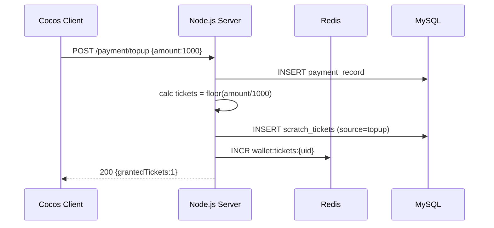
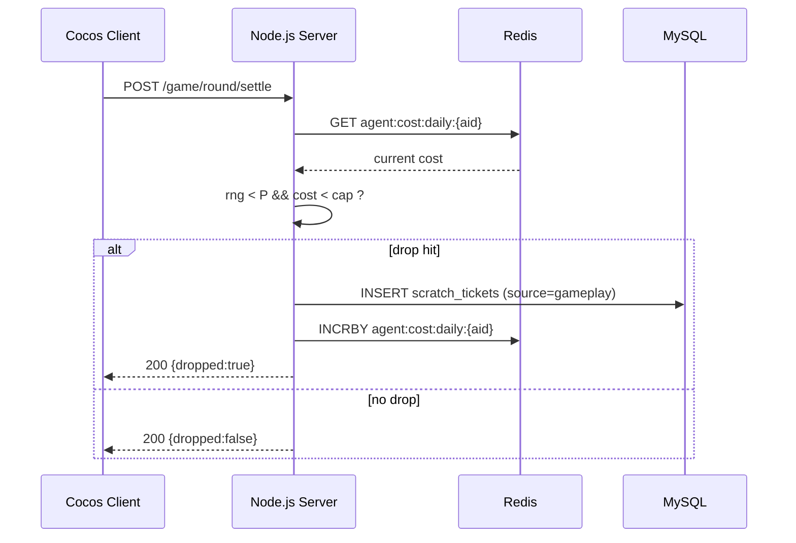
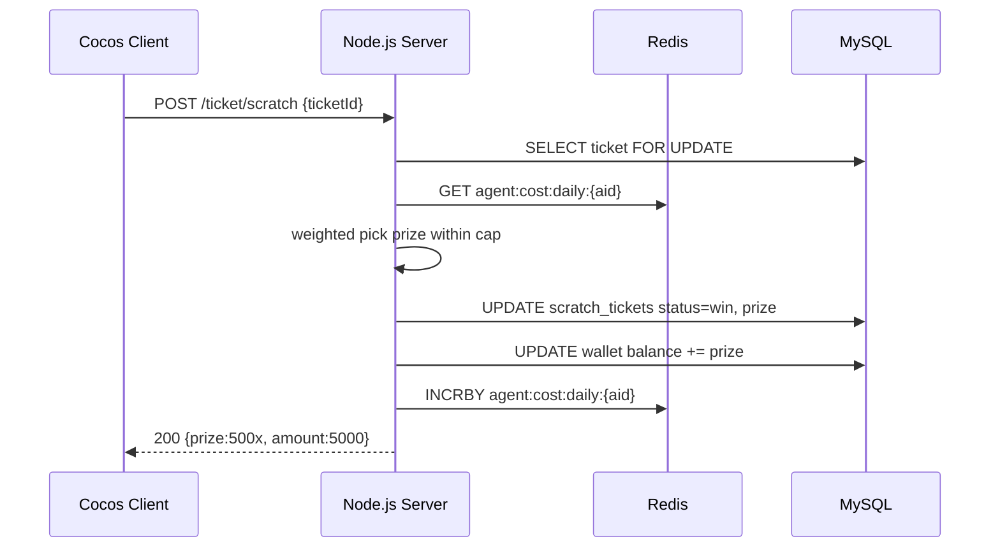
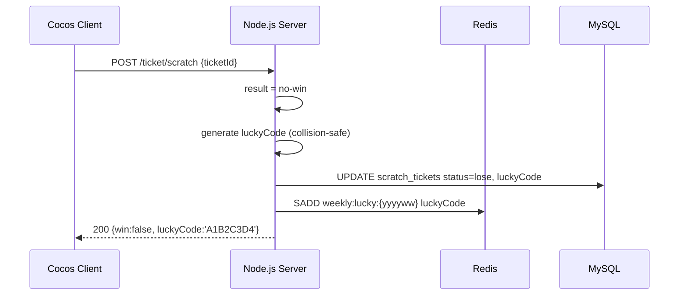
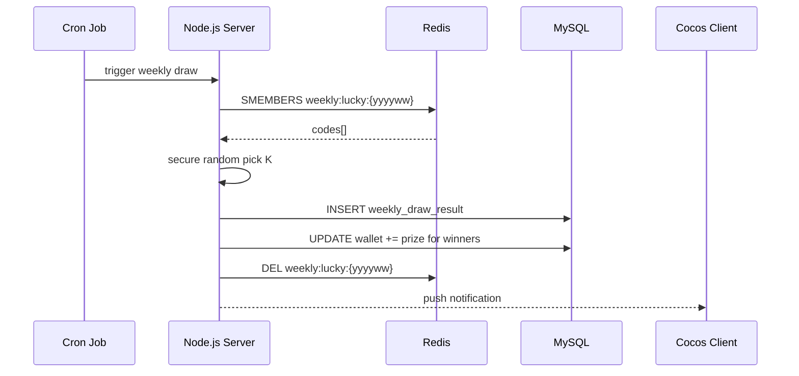
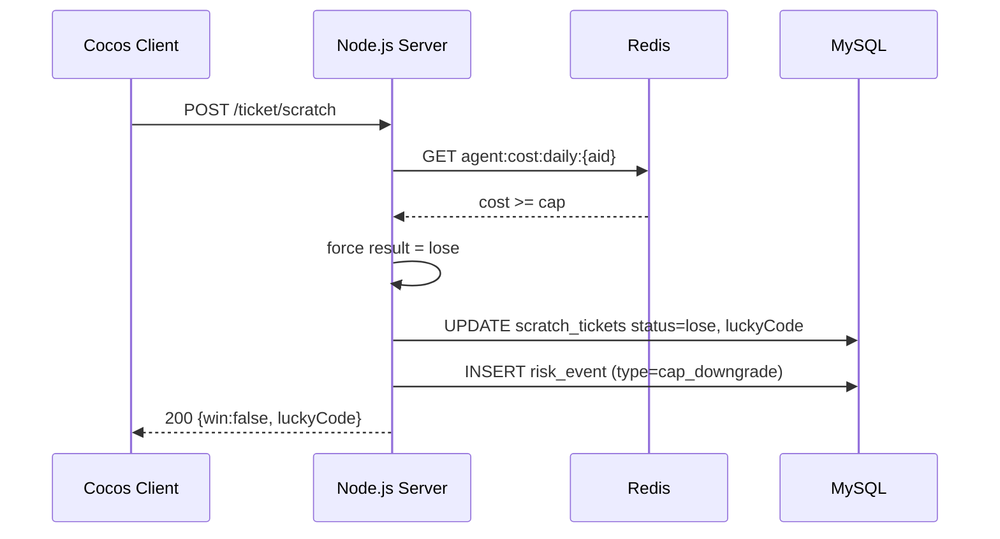
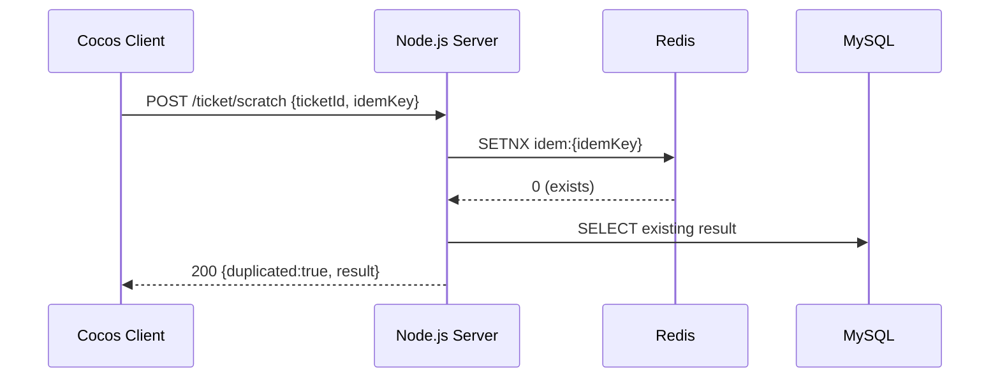
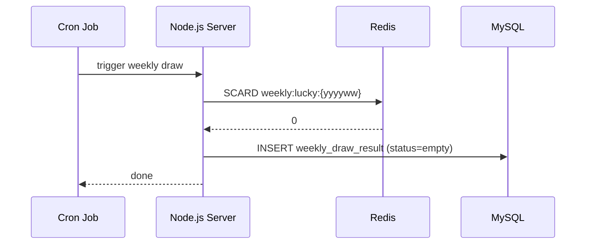

# 刮刮券抽獎系統 BDD 測試案例

共 8 個 Scenario。

## 索引
| ID | 標題 | 類型 |
|----|------|------|
| [`sc-001`](#sc-001) | 儲值滿1000自動發放刮刮券 | 正常 |
| [`sc-002`](#sc-002) | 遊戲中隨機掉落刮刮券 | 正常 |
| [`sc-003`](#sc-003) | 刮開刮刮券中獎(20-5000倍) | 正常 |
| [`sc-004`](#sc-004) | 未中獎刮刮券獲得幸運代號 | 正常 |
| [`sc-005`](#sc-005) | 每週幸運兒抽獎排程 | 正常 |
| [`sc-006`](#sc-006) | 代理商成本上限保護(邊界) | 邊界 |
| [`sc-007`](#sc-007) | 重複刮券防護(邊界) | 邊界 |
| [`sc-008`](#sc-008) | 幸運代號池為空週次(邊界) | 邊界 |

---

### <a id="sc-001"></a> Scenario: 儲值滿1000自動發放刮刮券
**類型**：正常（正常 / 邊界 / 異常）

**Gherkin（中）**
```gherkin
# language: zh-TW
Given 玩家為老玩家且已綁定帳號
And 玩家當前儲值累計為 0
When 玩家完成一筆 1000 元儲值
Then 系統應發放 1 張刮刮券至玩家券包
And 券包顯示新增 1 張未刮刮刮券
And 系統記錄發券來源為「儲值」
```

**Gherkin（英）**
```gherkin
Given the player is a returning user with bound account
And the player's accumulated top-up is 0
When the player completes a top-up of 1000
Then the system shall grant 1 scratch ticket to the player's wallet
And the wallet shows 1 new unscratched ticket
And the system records the grant source as 'topup'
```

**互動時序圖**


**涉及 API**
- [`api-topup-grant`](./scratch-ticket-lottery-spec-advanced.md#api-topup-grant)
- [`api-wallet-tickets`](./scratch-ticket-lottery-spec-advanced.md#api-wallet-tickets)

**後端資料來源**
- MySQL.payment_record
- MySQL.scratch_tickets
- Redis:wallet:tickets:{uid}

---

### <a id="sc-002"></a> Scenario: 遊戲中隨機掉落刮刮券
**類型**：正常（正常 / 邊界 / 異常）

**Gherkin（中）**
```gherkin
# language: zh-TW
Given 玩家正在進行遊戲
And 掉券機率設定為 P 且當日代理商成本未超限
When 玩家完成一局遊戲且觸發掉券判定
Then 系統應發放 1 張刮刮券
And 系統記錄發券來源為「遊戲掉落」
And 代理商當日成本累加對應金額
```

**Gherkin（英）**
```gherkin
Given the player is in an active game session
And drop rate P is configured and agent daily cost is within limit
When the player completes a round and triggers a drop check
Then the system shall grant 1 scratch ticket
And the source is recorded as 'gameplay'
And agent daily cost is incremented
```

**互動時序圖**


**涉及 API**
- [`api-game-settle`](./scratch-ticket-lottery-spec-advanced.md#api-game-settle)
- [`api-ticket-grant`](./scratch-ticket-lottery-spec-advanced.md#api-ticket-grant)

**後端資料來源**
- MySQL.scratch_tickets
- MySQL.agent_cost_ledger
- Redis:agent:cost:daily:{aid}

---

### <a id="sc-003"></a> Scenario: 刮開刮刮券中獎(20-5000倍)
**類型**：正常（正常 / 邊界 / 異常）

**Gherkin（中）**
```gherkin
# language: zh-TW
Given 玩家券包擁有 1 張未刮刮券
And 獎池配置含 20x~5000x 倍率
When 玩家點擊刮開該張券
Then 系統根據獎池機率與代理商成本上限決定中獎倍率
And 中獎金額入帳至玩家錢包
And 券狀態更新為「已刮-中獎」
And 顯示對應倍率動畫
```

**Gherkin（英）**
```gherkin
Given the player has 1 unscratched ticket
And the prize pool is configured with 20x~5000x tiers
When the player scratches the ticket
Then the server determines the prize tier under cost cap
And the prize is credited to wallet
And ticket status becomes 'scratched-win'
```

**互動時序圖**


**涉及 API**
- [`api-ticket-scratch`](./scratch-ticket-lottery-spec-advanced.md#api-ticket-scratch)
- [`api-wallet-credit`](./scratch-ticket-lottery-spec-advanced.md#api-wallet-credit)

**後端資料來源**
- MySQL.scratch_tickets
- MySQL.wallet
- MySQL.agent_cost_ledger
- Redis:agent:cost:daily:{aid}

---

### <a id="sc-004"></a> Scenario: 未中獎刮刮券獲得幸運代號
**類型**：正常（正常 / 邊界 / 異常）

**Gherkin（中）**
```gherkin
# language: zh-TW
Given 玩家擁有 1 張未刮刮券
When 玩家刮開該券且結果為未中獎
Then 系統產生唯一幸運代號(8碼)
And 幸運代號寫入當週抽獎池
And 券狀態更新為「已刮-未中-持代號」
And Client 顯示幸運代號供截圖
```

**Gherkin（英）**
```gherkin
Given the player has 1 unscratched ticket
When the scratch result is no-win
Then a unique 8-char lucky code is generated
And the code is added to the weekly draw pool
And ticket status becomes 'scratched-lose-coded'
```

**互動時序圖**


**涉及 API**
- [`api-ticket-scratch`](./scratch-ticket-lottery-spec-advanced.md#api-ticket-scratch)
- [`api-lucky-code`](./scratch-ticket-lottery-spec-advanced.md#api-lucky-code)

**後端資料來源**
- MySQL.scratch_tickets
- Redis:weekly:lucky:{yyyyww}

---

### <a id="sc-005"></a> Scenario: 每週幸運兒抽獎排程
**類型**：正常（正常 / 邊界 / 異常）

**Gherkin（中）**
```gherkin
# language: zh-TW
Given 當週幸運代號池含 N 個有效代號
And 設定週日 23:59 為開獎時間
When 排程觸發週抽獎
Then 系統從池中隨機抽出 K 位幸運兒
And 中獎獎金入帳並記錄於抽獎結果表
And 推播通知中獎玩家
And 開獎結果公告至活動頁
```

**Gherkin（英）**
```gherkin
Given the weekly lucky pool has N valid codes
And weekly draw is scheduled at Sun 23:59
When the scheduler triggers the draw
Then the system randomly picks K winners
And prizes are credited and results stored
And winners are notified
```

**互動時序圖**


**涉及 API**
- [`api-weekly-draw`](./scratch-ticket-lottery-spec-advanced.md#api-weekly-draw)
- [`api-notify-winner`](./scratch-ticket-lottery-spec-advanced.md#api-notify-winner)

**後端資料來源**
- MySQL.weekly_draw_result
- MySQL.wallet
- Redis:weekly:lucky:{yyyyww}

---

### <a id="sc-006"></a> Scenario: 代理商成本上限保護(邊界)
**類型**：邊界（正常 / 邊界 / 異常）

**Gherkin（中）**
```gherkin
# language: zh-TW
Given 代理商當日累計派彩成本已達上限 cap
And 玩家刮開一張刮刮券
When 系統判定獎池抽獎
Then 系統強制將結果降級為未中獎或最低倍率
And 記錄風控降級事件
And 不超發代理商成本
```

**Gherkin（英）**
```gherkin
Given agent daily cost has reached cap
When a player scratches a ticket
Then the result must be downgraded to no-win or lowest tier
And a risk-control event is logged
```

**互動時序圖**


**涉及 API**
- [`api-ticket-scratch`](./scratch-ticket-lottery-spec-advanced.md#api-ticket-scratch)
- [`api-risk-log`](./scratch-ticket-lottery-spec-advanced.md#api-risk-log)

**後端資料來源**
- MySQL.scratch_tickets
- MySQL.risk_event
- Redis:agent:cost:daily:{aid}

---

### <a id="sc-007"></a> Scenario: 重複刮券防護(邊界)
**類型**：邊界（正常 / 邊界 / 異常）

**Gherkin（中）**
```gherkin
# language: zh-TW
Given 玩家持有一張已刮的刮刮券
When 玩家因網路重送或惡意重放再次提交刮券請求
Then 系統以券狀態與冪等鍵判定為重複
And 回傳既有結果而不重複派獎
And 不重複佔用代理商成本
```

**Gherkin（英）**
```gherkin
Given a ticket has been scratched
When a duplicate scratch request arrives
Then the system returns the existing result idempotently
```

**互動時序圖**


**涉及 API**
- [`api-ticket-scratch`](./scratch-ticket-lottery-spec-advanced.md#api-ticket-scratch)

**後端資料來源**
- MySQL.scratch_tickets
- Redis:idem:{idemKey}

---

### <a id="sc-008"></a> Scenario: 幸運代號池為空週次(邊界)
**類型**：邊界（正常 / 邊界 / 異常）

**Gherkin（中）**
```gherkin
# language: zh-TW
Given 當週幸運代號池為空(無未中獎玩家)
When 排程觸發週抽獎
Then 系統應跳過開獎
And 記錄空池事件
And 公告本週流獎或順延規則
```

**Gherkin（英）**
```gherkin
Given the weekly lucky pool is empty
When the scheduler triggers
Then the system shall skip the draw and log an empty-pool event
```

**互動時序圖**


**涉及 API**
- [`api-weekly-draw`](./scratch-ticket-lottery-spec-advanced.md#api-weekly-draw)

**後端資料來源**
- MySQL.weekly_draw_result
- Redis:weekly:lucky:{yyyyww}

---

