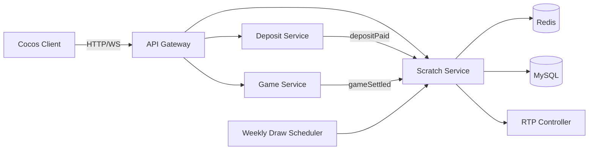

# 刮刮券儲值回饋與週抽獎活動 技術規格書

## 一、系統架構概覽
由 Scratch Service 處理刮刮券發放、刮獎、幸運代號註冊與週抽獎；Deposit Service 透過 MQ/事件觸發儲值滿額發券；Game Service 在遊戲結算時隨機觸發掉券。MySQL 儲存券、刮獎結果、幸運代號、週抽獎結果與代理商成本控制帳本；Redis 用於發券冷卻、刮獎防併發鎖、週獎池配額、活躍代號集合與排行榜。所有獎金倍率與機率由 RTP 控制器集中管理，確保代理商不損失。



**Client ↔ Server 資料流**：1) 玩家儲值 → Deposit Service 發 depositPaid 事件 → Scratch Service 依累計金額/1000 發券寫入 scratch_cards 並產生唯一 lucky_code。2) 玩家進入遊戲結算 → Game Service 依掉券機率呼叫 Scratch Service 發券。3) Client 拉取券列表 → 選擇券呼叫刮獎 API → Server 經 Redis 鎖 + RTP 控制器決定中獎倍率 → 寫入 scratch_results + 更新成本帳本 + 派彩。4) 每週日 23:59 Scheduler 從未中獎幸運代號池隨機抽出週幸運兒 → 寫入 weekly_draws → 推播 Client。

## 二、Cocos Creator Client 實作要點
- **建議場景結構**：主場景 ScratchScene 內含 CouponListPanel（券清單）、ScratchView（刮獎面板，使用 Graphics + 遮罩實作刮塗層）、PrizeDialog（中獎彈窗）、LuckyCodeBoard（幸運代號展示）、WeeklyDrawBanner（週抽獎倒數與得獎輪播）。
- **主要 Components**：
  - `CouponListController` — 請求 /scratch/coupons，渲染可刮券、已刮券、來源（儲值/遊戲）
  - `ScratchCardView` — 使用 cc.Graphics + BlendMode DESTINATION_OUT 實作刮塗層，計算刮開比例 ≥60% 自動 reveal
  - `PrizeRevealAnim` — 播放中獎倍率動畫（20x~5000x）與未中獎時顯示 lucky_code
  - `WeeklyDrawWidget` — 訂閱 WS 主題 weekly_draw 顯示倒數與本週得獎名單
  - `NetworkClient` — 封裝 HTTP + WS、Bearer Token、斷線重連
- **動畫狀態機**：

| 狀態 | 觸發 | 下一狀態 |
|------|------|---------|
| Idle | enterScene | LoadingCoupons |
| LoadingCoupons | couponsLoaded | CouponList |
| CouponList | selectCoupon | Scratching |
| Scratching | scratchRatio>=0.6 | Revealing |
| Revealing | resultAck | CouponList |
| CouponList | weeklyDrawPush | WeeklyResult |
| WeeklyResult | close | CouponList |

- **資料更新**：券清單採開啟拉一次 + 操作後增量更新；週抽獎結果採 WebSocket 推播；倒數計時 Client 本地計算。
- **效能考量**：刮塗層使用單一 RenderTexture 避免每幀 redraw；中獎動畫使用 Spine + 物件池；列表使用 cc.ScrollView 虛擬列表，>200 張券仍維持 60fps。

## 三、Node.js Server API 規格

### API 端點列表
| ID | Method | Endpoint | 說明 | 認證 | 讀 | 寫 |
|----|--------|----------|------|------|----|----|
| [`api-001`](#api-001) | GET | /api/v1/scratch/coupons | 取得我的刮刮券清單 | Bearer Token | MySQL.scratch_cards / Redis:scratch:coupons:{user_id} | Redis:scratch:coupons:{user_id} (cache) |
| [`api-002`](#api-002) | POST | /api/v1/scratch/cards/:card_id/scratch | 刮開指定刮刮券 | Bearer Token | MySQL.scratch_cards / MySQL.rtp_ledger / Redis:scratch:lock:{card_id} | MySQL.scratch_cards / MySQL.scratch_results / MySQL.rtp_ledger / Redis:scratch:lucky_pool:{week} / Redis:wallet:{user_id} |
| [`api-003`](#api-003) | GET | /api/v1/scratch/lucky-codes | 查詢我的幸運代號 | Bearer Token | MySQL.lucky_codes | - |
| [`api-004`](#api-004) | GET | /api/v1/scratch/weekly-draw | 取得本週/歷史週抽獎結果 | Bearer Token | MySQL.weekly_draws / Redis:weekly:draw:{week} | - |
| [`api-005`](#api-005) | POST | /api/v1/internal/scratch/grant | 內部介面：儲值或遊戲事件觸發發券 | Internal Service Token | MySQL.deposit_rebate_progress | MySQL.scratch_cards / MySQL.lucky_codes / MySQL.deposit_rebate_progress / Redis:scratch:grant:idem:{event_id} |
| [`api-006`](#api-006) | POST | /api/v1/internal/scratch/weekly-draw/run | 內部介面：執行週抽獎（由 Scheduler 呼叫） | Internal Service Token | Redis:scratch:lucky_pool:{week} / MySQL.lucky_codes / MySQL.rtp_ledger | MySQL.weekly_draws / MySQL.rtp_ledger / Redis:weekly:draw:{week} |

### 各 API 詳細規格

#### <a id="api-001"></a> [api-001] GET /api/v1/scratch/coupons
- **說明**：取得我的刮刮券清單
- **認證**：Bearer Token
- **Query Params**：
  - `status` string default=all — all|unscratched|scratched
  - `page` int default=1 — 頁碼
  - `size` int default=20 — 每頁筆數，最大50
- **Response 200**：
```json
{
  "code": 200,
  "data": {
    "total": 12,
    "items": [
      {"card_id": "c_8821", "source": "deposit", "lucky_code": "LC-20260513-000123", "status": "unscratched", "expire_at": "2026-05-20T23:59:59Z"}
    ]
  }
}
```
- **Errors**：
  - `401` 未登入
  - `429` 請求過快
- **後端流程**：
  1. 驗證 token
  2. 讀 Redis cache，miss 則查 scratch_cards
  3. 回傳分頁結果並回填 cache 60s
- **效能要求**：p95 < 80ms / QPS 2000
- **相關 BDD**：[`sc-001`](./scratch-card-rebate-bdd.md#sc-001), [`sc-002`](./scratch-card-rebate-bdd.md#sc-002)
#### <a id="api-002"></a> [api-002] POST /api/v1/scratch/cards/:card_id/scratch
- **說明**：刮開指定刮刮券
- **認證**：Bearer Token
- **Response 200**：
```json
{
  "code": 200,
  "data": {
    "card_id": "c_8821",
    "is_win": true,
    "multiplier": 100,
    "prize_amount": 10000,
    "lucky_code": "LC-20260513-000123",
    "balance_after": 158000
  }
}
```
- **Errors**：
  - `401` 未登入
  - `4001` 券不存在或不屬於該玩家
  - `4002` 券已刮過
  - `4003` 券已過期
  - `4004` 併發鎖定中
- **後端流程**：
  1. SETNX Redis 鎖 scratch:lock:{card_id} 5s
  2. 驗證券狀態與擁有者
  3. 呼叫 RTP Controller 決定本次中獎倍率（受代理商成本上限約束）
  4. 若中獎：更新錢包、寫 scratch_results、扣 rtp_ledger 預算
  5. 若未中獎：將 lucky_code 加入 Redis:scratch:lucky_pool:{week} ZSET
  6. 原子更新 scratch_cards.status=scratched
  7. 釋放鎖並回傳
- **效能要求**：p95 < 120ms / QPS 1500
- **相關 BDD**：[`sc-003`](./scratch-card-rebate-bdd.md#sc-003), [`sc-004`](./scratch-card-rebate-bdd.md#sc-004), [`sc-005`](./scratch-card-rebate-bdd.md#sc-005)
#### <a id="api-003"></a> [api-003] GET /api/v1/scratch/lucky-codes
- **說明**：查詢我的幸運代號
- **認證**：Bearer Token
- **Query Params**：
  - `week` string default=current — ISO week，例如 2026-W20
- **Response 200**：
```json
{
  "code": 200,
  "data": {
    "week": "2026-W20",
    "codes": ["LC-20260513-000123", "LC-20260513-000456"]
  }
}
```
- **Errors**：
  - `401` 未登入
- **後端流程**：
  1. 驗證 token
  2. 查 lucky_codes by user_id + week
  3. 回傳
- **效能要求**：p95 < 60ms / QPS 1000
- **相關 BDD**：[`sc-006`](./scratch-card-rebate-bdd.md#sc-006)
#### <a id="api-004"></a> [api-004] GET /api/v1/scratch/weekly-draw
- **說明**：取得本週/歷史週抽獎結果
- **認證**：Bearer Token
- **Query Params**：
  - `week` string default=latest — 指定 ISO week
- **Response 200**：
```json
{
  "code": 200,
  "data": {
    "week": "2026-W19",
    "draw_at": "2026-05-11T15:59:00Z",
    "winners": [
      {"lucky_code": "LC-20260506-009988", "user_masked": "u***88", "prize_amount": 500000, "multiplier": 5000}
    ]
  }
}
```
- **Errors**：
  - `401` 未登入
  - `4040` 該週尚未開獎
- **後端流程**：
  1. 讀 Redis cache
  2. miss 則讀 weekly_draws
  3. 回填 cache 300s
- **效能要求**：p95 < 50ms / QPS 3000
- **相關 BDD**：[`sc-007`](./scratch-card-rebate-bdd.md#sc-007)
#### <a id="api-005"></a> [api-005] POST /api/v1/internal/scratch/grant
- **說明**：內部介面：儲值或遊戲事件觸發發券
- **認證**：Internal Service Token
- **Response 200**：
```json
{
  "code": 200,
  "data": {"granted": 2, "card_ids": ["c_8821", "c_8822"]}
}
```
- **Errors**：
  - `401` 非內部呼叫
  - `4090` 事件重複（冪等）
- **後端流程**：
  1. 以 event_id 做 Redis 冪等鎖
  2. 若來源=deposit：累加 deposit_rebate_progress.amount，每滿 1000 發 1 張券
  3. 若來源=game：依配置機率擲骰決定是否掉券
  4. 批次 INSERT scratch_cards 與 lucky_codes
  5. 回傳發券結果
- **效能要求**：p95 < 100ms / QPS 5000
- **相關 BDD**：[`sc-008`](./scratch-card-rebate-bdd.md#sc-008), [`sc-009`](./scratch-card-rebate-bdd.md#sc-009)
#### <a id="api-006"></a> [api-006] POST /api/v1/internal/scratch/weekly-draw/run
- **說明**：內部介面：執行週抽獎（由 Scheduler 呼叫）
- **認證**：Internal Service Token
- **Query Params**：
  - `week` string default=current — ISO week
- **Response 200**：
```json
{
  "code": 200,
  "data": {"week": "2026-W20", "winner_count": 3}
}
```
- **Errors**：
  - `401` 非內部呼叫
  - `4091` 該週已開獎
- **後端流程**：
  1. 檢查 weekly_draws 該週是否已存在
  2. 從 Redis ZSET 隨機抽 N 名（依預算決定 N 與獎金）
  3. 透過 RTP Controller 驗證代理商剩餘預算
  4. 寫 weekly_draws、扣 rtp_ledger、派彩
  5. 設 Redis cache 並推播 WS
- **效能要求**：p95 < 800ms / 每週 1 次
- **相關 BDD**：[`sc-010`](./scratch-card-rebate-bdd.md#sc-010)

## 四、資料模型

### scratch_cards（MySQL Table）
刮刮券主檔

| 欄位 | 型別 | 說明 |
|------|------|------|
| `id` | BIGINT UNSIGNED PK AUTO_INCREMENT | PK |
| `card_id` | VARCHAR(32) NOT NULL | 對外券號 |
| `user_id` | BIGINT UNSIGNED NOT NULL | 擁有者 |
| `agent_id` | BIGINT UNSIGNED NOT NULL | 所屬代理商 |
| `source` | ENUM('deposit','game') NOT NULL | 發券來源 |
| `source_ref` | VARCHAR(64) | 來源事件 id |
| `lucky_code` | VARCHAR(32) NOT NULL | 幸運代號 |
| `status` | ENUM('unscratched','scratched','expired') NOT NULL DEFAULT 'unscratched' | 狀態 |
| `multiplier` | INT UNSIGNED | 中獎倍率，未刮為 NULL |
| `prize_amount` | BIGINT UNSIGNED | 派彩金額(分) |
| `created_at` | DATETIME NOT NULL | 發券時間 |
| `scratched_at` | DATETIME | 刮獎時間 |
| `expire_at` | DATETIME NOT NULL | 過期時間 |

**索引**：UNIQUE KEY uk_card_id(card_id), INDEX idx_user_status(user_id,status), INDEX idx_agent_created(agent_id,created_at), UNIQUE KEY uk_lucky_code(lucky_code)
**讀寫 API**：`api-001`, `api-002`, `api-005`
### scratch_results（MySQL Table）
刮獎結果流水

| 欄位 | 型別 | 說明 |
|------|------|------|
| `id` | BIGINT UNSIGNED PK AUTO_INCREMENT | PK |
| `card_id` | VARCHAR(32) NOT NULL | 券號 |
| `user_id` | BIGINT UNSIGNED NOT NULL | 玩家 |
| `is_win` | TINYINT(1) NOT NULL | 是否中獎 |
| `multiplier` | INT UNSIGNED NOT NULL DEFAULT 0 | 倍率 |
| `prize_amount` | BIGINT UNSIGNED NOT NULL DEFAULT 0 | 派彩金額(分) |
| `rtp_snapshot` | JSON | 當下 RTP 控制器決策快照 |
| `created_at` | DATETIME NOT NULL | 建立時間 |

**索引**：UNIQUE KEY uk_card_id(card_id), INDEX idx_user_created(user_id,created_at)
**讀寫 API**：`api-002`
### lucky_codes（MySQL Table）
幸運代號池（含未中獎與已中獎券皆登錄）

| 欄位 | 型別 | 說明 |
|------|------|------|
| `id` | BIGINT UNSIGNED PK AUTO_INCREMENT | PK |
| `lucky_code` | VARCHAR(32) NOT NULL | 幸運代號 |
| `user_id` | BIGINT UNSIGNED NOT NULL | 擁有者 |
| `card_id` | VARCHAR(32) NOT NULL | 關聯券 |
| `week` | VARCHAR(10) NOT NULL | ISO 週，例如 2026-W20 |
| `eligible_weekly` | TINYINT(1) NOT NULL DEFAULT 1 | 是否進入週抽池 |
| `created_at` | DATETIME NOT NULL | 建立時間 |

**索引**：UNIQUE KEY uk_lucky_code(lucky_code), INDEX idx_week_eligible(week,eligible_weekly), INDEX idx_user_week(user_id,week)
**讀寫 API**：`api-003`, `api-005`, `api-006`
### weekly_draws（MySQL Table）
週抽獎結果

| 欄位 | 型別 | 說明 |
|------|------|------|
| `id` | BIGINT UNSIGNED PK AUTO_INCREMENT | PK |
| `week` | VARCHAR(10) NOT NULL | ISO 週 |
| `lucky_code` | VARCHAR(32) NOT NULL | 中獎代號 |
| `user_id` | BIGINT UNSIGNED NOT NULL | 中獎人 |
| `agent_id` | BIGINT UNSIGNED NOT NULL | 中獎人代理商 |
| `multiplier` | INT UNSIGNED NOT NULL | 倍率 |
| `prize_amount` | BIGINT UNSIGNED NOT NULL | 派彩金額(分) |
| `draw_at` | DATETIME NOT NULL | 開獎時間 |

**索引**：UNIQUE KEY uk_week_code(week,lucky_code), INDEX idx_week(week), INDEX idx_user(user_id)
**讀寫 API**：`api-004`, `api-006`
### deposit_rebate_progress（MySQL Table）
玩家儲值累計回饋進度（用於每滿 1000 發券）

| 欄位 | 型別 | 說明 |
|------|------|------|
| `user_id` | BIGINT UNSIGNED PK | PK 玩家 |
| `accumulated_amount` | BIGINT UNSIGNED NOT NULL DEFAULT 0 | 累計儲值金額(分) |
| `granted_cards` | BIGINT UNSIGNED NOT NULL DEFAULT 0 | 已發券數 |
| `updated_at` | DATETIME NOT NULL | 更新時間 |

**索引**：PRIMARY KEY(user_id)
**讀寫 API**：`api-005`
### rtp_ledger（MySQL Table）
代理商成本/獎金預算帳本，確保代理商不損失

| 欄位 | 型別 | 說明 |
|------|------|------|
| `id` | BIGINT UNSIGNED PK AUTO_INCREMENT | PK |
| `agent_id` | BIGINT UNSIGNED NOT NULL | 代理商 |
| `period` | VARCHAR(10) NOT NULL | 日期或 ISO 週 |
| `income` | BIGINT UNSIGNED NOT NULL DEFAULT 0 | 期間玩家投注/儲值貢獻(分) |
| `payout` | BIGINT UNSIGNED NOT NULL DEFAULT 0 | 期間刮刮券派彩(分) |
| `budget_cap` | BIGINT UNSIGNED NOT NULL | 派彩上限(分)，= income * max_rtp% |
| `updated_at` | DATETIME NOT NULL | 更新時間 |

**索引**：UNIQUE KEY uk_agent_period(agent_id,period), INDEX idx_period(period)
**讀寫 API**：`api-002`, `api-006`

## 五、業務邏輯

### 儲值滿千發券
玩家每累計儲值 1000（單位：元，內部以分計算）發 1 張刮刮券；採累計制避免拆單，granted = floor(accumulated/1000) - already_granted。

```
function onDepositPaid(evt){
  withIdem(evt.id, ()=>{
    const p = upsertProgress(evt.user_id, +evt.amount_cents);
    const target = Math.floor(p.accumulated_amount / 100000); // 1000元=100000分
    const toGrant = target - p.granted_cards;
    if(toGrant>0){
      insertScratchCards(evt.user_id, evt.agent_id, 'deposit', toGrant);
      p.granted_cards = target; save(p);
    }
  });
}
```
### 遊戲中掉券
遊戲結算事件依配置 dropRate（受 RTP 預算動態調整）擲骰決定是否掉券，單次至多 1 張，避免刷分。

```
function onGameSettled(evt){
  const rate = rtp.getDropRate(evt.agent_id);
  if(rand() < rate){ insertScratchCards(evt.user_id, evt.agent_id, 'game', 1, evt.id); }
}
```
### 刮獎中獎判定（受 RTP 約束）
中獎倍率表 [0(未中),20,50,100,500,1000,5000]，每檔基礎機率由配置決定，但實際派彩前需通過 rtp_ledger 預算檢查；若預算不足，降檔或判定未中獎，確保代理商當期 payout ≤ budget_cap。

```
function scratch(card){
  lock(card.id);
  const base = pickByWeight(prizeTable);
  const ledger = rtp.get(card.agent_id, currentPeriod());
  let final = base;
  while(final>0 && ledger.payout + bet*final > ledger.budget_cap){ final = downgrade(final); }
  if(final===0){ markUnwin(card); addLuckyPool(card.lucky_code); }
  else { payout(card.user_id, bet*final); markWin(card, final); ledger.payout += bet*final; }
  unlock(card.id);
}
```
### 週幸運兒抽獎
每週日 23:59 從本週 lucky_codes (eligible_weekly=1 且未中獎) 隨機抽 N 名，N 與獎金依當週剩餘預算動態決定，至少 1 名。

```
function weeklyDraw(week){
  if(exists(weekly_draws, week)) return;
  const pool = redis.zrange('scratch:lucky_pool:'+week, 0, -1);
  const budget = rtp.weeklyRemainingBudget(week);
  const winners = sampleWinners(pool, budget);
  insertWeeklyDraws(week, winners);
  payoutAll(winners);
  ws.broadcast('weekly_draw', {week, winners: mask(winners)});
}
```
### 幸運代號產生規則
格式 LC-YYYYMMDD-XXXXXX，XXXXXX 為當日序號，全域唯一；發券時同步寫入 lucky_codes。

```
code = 'LC-' + ymd(now) + '-' + zeroPad(dailySeq.incr(), 6);
```

## 六、Cache 策略
- **scratch:coupons:{user_id}** (60s) — 玩家券清單快取，刮獎/發券時 DEL
- **scratch:lock:{card_id}** (5s) — 刮獎併發鎖，SETNX
- **scratch:grant:idem:{event_id}** (24h) — 發券冪等鍵
- **scratch:lucky_pool:{week}** (14d) — 當週未中獎幸運代號 ZSET，score=timestamp，供週抽獎隨機取樣
- **weekly:draw:{week}** (300s) — 週抽獎結果快取
- **rtp:ledger:{agent_id}:{period}** (60s) — 代理商預算讀取快取，寫入走 DB
- **wallet:{user_id}** (30s) — 錢包餘額快取，派彩後 DEL

## 七、相關文件
- 資源清單：[`scratch-card-rebate-assets.md`](./scratch-card-rebate-assets.md)
- BDD 測試：[`scratch-card-rebate-bdd.md`](./scratch-card-rebate-bdd.md)
- SCRUM：[`scratch-card-rebate-scrum.md`](./scratch-card-rebate-scrum.md)
