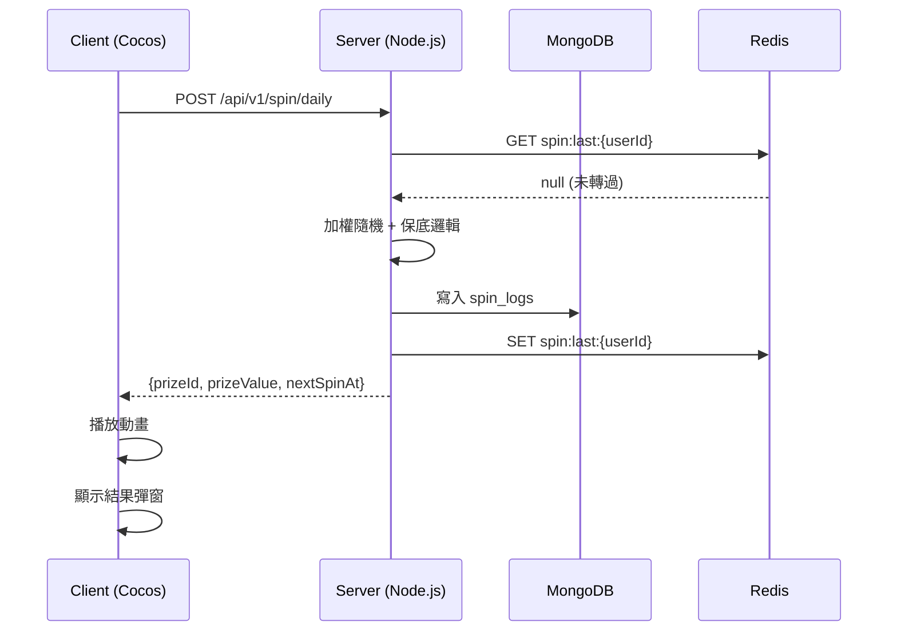

# GeneCR — 完整產品需求文件（PRD）

> 版本：v1.1 ｜ 日期：2026-05-13  
> 作者：Evans（sayyogames.com）

---

## 一、產品願景

GeneCR 的目標是讓 iGaming 公司的企畫人員，能透過一行指令，產出讓 **整個開發團隊都能直接使用** 的需求文件套件。

**使用對象：**
- 企畫（Product Manager / Game Designer）
- 美術 / 動畫師 / 音效師
- Client 工程師（Cocos Creator）
- Server 工程師（Node.js）
- QA 工程師
- SCRUM Master / Project Manager

---

## 二、核心功能需求

### 2.1 競業調查
- 強制調查指定競業：TaDa Gaming、SlotsMaker
- 按市場擴展調查：北美、哥斯大黎加、東南亞、台灣
- 每個競業必須記錄**來源 URL**，可點擊開新分頁
- 至少 6 個以上不同平台案例

### 2.2 輸出文件套件（7 份）
每次執行必須完整輸出以下 7 份文件到 `./output/<feature-slug>/`：

| # | 檔案 | 說明 |
|---|------|------|
| 1 | `*-spec-basic.md` | 企畫版規格書（含線框圖 DSL）|
| 2 | `*-spec-advanced.md` | 技術規格書（Mermaid 圖、API 規格）|
| 3 | `*-assets.md` | 完整資源清單＋AI Prompt |
| 4 | `*-bdd.md` | 完整 BDD（Gherkin，中英文）|
| 5 | `*-scrum.md` | SCRUM 故事卡＋Sprint 規劃 |
| 6 | `*-docs.html` | 切換式 HTML 文件（**見品質規範**）|
| 7 | `*-prototype.html` | 互動原型（**見品質規範**）|

### 2.3 語言
- 所有文件雙語：**繁體中文 + 英文**
- HTML 文件提供語言切換按鈕，**必須切換全部內容**（包含 Tab 名稱、章節標題、正文、表格、BDD）

### 2.4 技術棧
- Client：Cocos Creator
- Server：Node.js + Fastify
- DB：MongoDB + Redis
- 動畫：Spine / DragonBones
- 音效：WAV / OGG

---

## 三、品質規範

### 3.1 線框圖標準
- 企畫版文件**必須包含低保真 wireframe**（參考 `preview.html` 的 wireframe DSL 樣式）
- 線框圖需涵蓋：主畫面、獲獎彈窗、後台設定頁、倒數狀態
- 風格：白底、黑色邊框、placeholder 標示、skeleton 元素
- 圖文並排：每個畫面線框圖旁邊有對應的功能說明

### 3.2 工程圖標準
- **禁止使用 ASCII art**，改用 **Mermaid 語法**
- 每個 API endpoint 必須有對應的 **Sequence Diagram**
- API 文件需有互動式 input/output 展示（在 HTML 中可修改 input 看 output 格式）

### 3.3 HTML 文件（*-docs.html）
- 版面 **100% 寬度響應式**，不得有固定小寬度限制
- 語言切換必須影響**所有內容**（Tab、標題、正文、表格、BDD、資源清單）
- 含一個「開啟原型」按鈕，點擊後在**新視窗**開啟 `*-prototype.html`
- BDD section 所有 Scenario **全展開**，不使用 Accordion 收折
- 資源清單數量與文件目錄一致，**全部完整列出**
- 競業分析的每個競業名稱/連結可**點擊開新分頁**

### 3.4 互動原型（*-prototype.html）
- **完全響應式**，自適應瀏覽器寬度（不得有固定小寬度）
- 在桌機/平板/手機上都應正常顯示
- 不依賴外部 CDN（完全離線可用）
- 左上角有操作說明面板

---

## 四、已知 Issues（待修正）

### Issue #1：企畫文件缺少線框圖
**問題**：spec-basic.md 和 docs.html 企畫版全為文字，缺少低保真線框圖  
**期望**：參考 `preview.html` 的 wireframe 風格，每個畫面都要有線框圖，圖文並排  
**影響**：企畫版、HTML 文件的企畫 Tab  
**優先級**：P0

### Issue #2：HTML 寬度未自適應
**問題**：`lucky-wheel-docs.html` 內容區域有 `max-width: 420px` 限制，在桌機上顯示偏小  
**期望**：寬度 100%，左右 padding 合理，所有 grid 響應式  
**影響**：docs.html  
**優先級**：P0

### Issue #3：語言切換只改部分內容
**問題**：點擊「繁中/EN」按鈕，只有少部分文字切換，Tab 名稱、表格內容、BDD 等未切換  
**期望**：所有內容（Tab、標題、正文、表格、BDD Scenario、資源名稱）都要切換  
**影響**：docs.html  
**優先級**：P0

### Issue #4：文件缺少原型連結
**問題**：docs.html 沒有連結到 prototype.html  
**期望**：在文件頂部或浮動按鈕，點擊後在新視窗開啟 prototype.html  
**影響**：docs.html  
**優先級**：P1

### Issue #5：資源清單數量不一致
**問題**：資源統計寫「20 圖片 + 6 動畫 + 8 音效 + 4 特效 = 38 個」，但 HTML 中只展開了 4 個  
**期望**：所有 38 個資源條目完整列出，每個都有完整 AI Prompt  
**影響**：docs.html 的資源清單 Tab  
**優先級**：P0

### Issue #6：BDD 未全展開
**問題**：docs.html 中 BDD Scenario 使用 Accordion 收折，只展開部分案例  
**期望**：所有 14 個 Scenario 全部展開，讓人一眼看到完整測試範圍  
**影響**：docs.html 的 BDD Tab  
**優先級**：P0

### Issue #7：Prototype 未響應式
**問題**：prototype.html 有 `max-width: 420px` 限制，在大螢幕上小小一個  
**期望**：完全響應式，桌機時展開為大版面（可左右分欄：左邊互動，右邊說明）  
**影響**：prototype.html  
**優先級**：P0

### Issue #8：競業分析缺少可點擊連結
**問題**：競業分析表格沒有連結，無法直接查看競業平台  
**期望**：每個競業名稱都是可點擊連結，`target="_blank"` 開新分頁  
**影響**：docs.html 企畫版、spec-basic.md  
**優先級**：P1

---

## 五、Mermaid 圖規範

所有技術文件必須使用 Mermaid 語法，範例：

---

## 六、線框圖 DSL 規範（企畫版）

線框圖使用與 `preview.html` 相同的低保真 wireframe 風格：
- 白底背景（`#f6f7f9`）
- 黑色邊框（`var(--ink): #1f2937`）
- Skeleton placeholder（條紋填充）
- 每個畫面有標題說明

---

## 七、未來規劃

- [ ] PDF 自動生成功能
- [ ] 自動截取競業平台截圖
- [ ] 多語言輸出（日文、韓文、英文版）
- [ ] 與 JIRA / Linear 整合（自動建立 Story）
- [ ] 節慶主題自動切換（聖誕、農曆新年）

---

*文件版本：v1.1 ｜ 由 GeneCR 專案維護*
