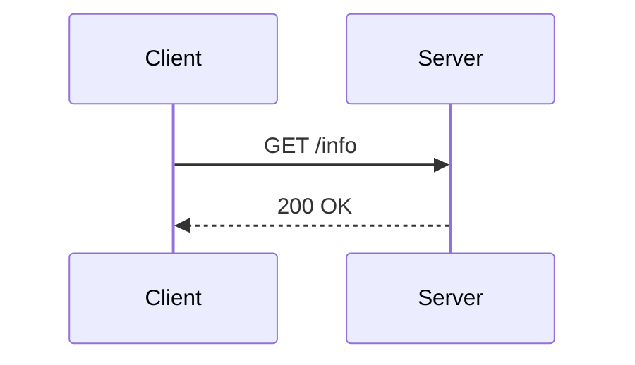
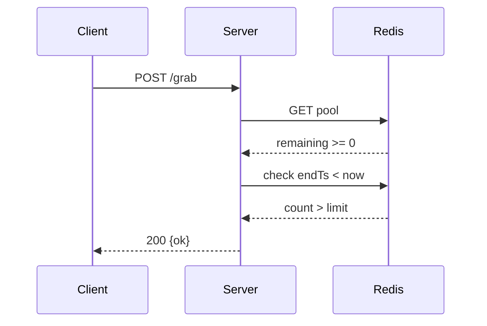
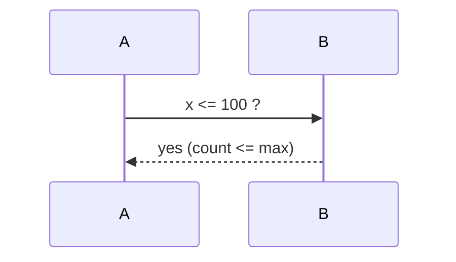

# Mermaid Sanitize Test

測試 sequenceDiagram 內含 `<`、`>`、`<=`、`>=` 是否會破圖。

## Case 1: 正常箭頭（應渲染）

## Case 2: 含 `<` `>` `>=` 在 message label（修復前破圖；修復後應顯示真正的 < >）

## Case 3: 含 `<=`

## 驗證

1. 用瀏覽器開生成的 html
2. 三張圖都應正常渲染（不是白框 / 不是文字）
3. Case 2、3 的 message 文字應出現真實的 `<`、`>`、`>=`、`<=` 字元
